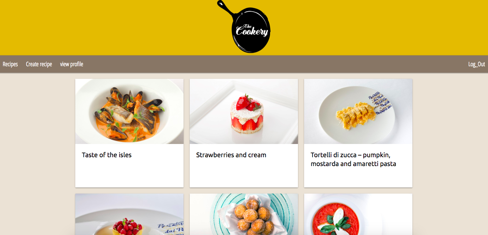

# **The cookery** (Recipes website)

## **Description:**

This is a web application that allows users to share there recipes to the world.

## **Link:**

[**The cookery**](https://damp-bayou-44259.herokuapp.com/)

## **Used Technologies:**

- ruby on rails
- HTML5
- CSS
  

## **Credits:**

- [meterialize](https://materializecss.com/)
- [Google Fonts](https://fonts.google.com/)
- [cloudinary](https://cloudinary.com/)
- [heroku](https://dashboard.heroku.com/login)
- [postgress](https://www.postgresql.org/)

## **Features:**

- Create new recipes 
- Edit recipes
- Delete recipes
- Adding comments for signed-in and guest users
- Removing comment for signed-in users
## **Future Ideas:**

- Adding search bar
- list of recipes categories
  

